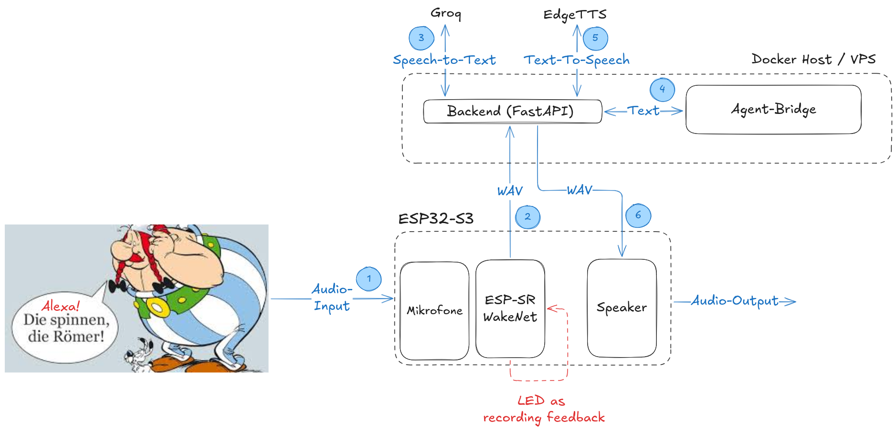

# ESP32-S3 Voice Assistant

Hybrid Edge/Cloud voice assistant for a Waveshare ESP32-S3 Audio Board.

The ESP32 handles hardware-near work:

```text
wakeword, recording, LED feedback, Wi-Fi upload, speaker playback
```

The backend handles compute-heavy work:

```text
STT, agent orchestration, web search, skills, TTS
```

## Architecture



```text
ESP32 WakeNet wakeword
-> record user speech as WAV
-> upload to backend
-> Groq STT
-> Pi agent bridge
-> optional web_search / skills
-> Edge TTS
-> WAV response
-> ESP32 speaker playback
-> wait for next wakeword
```

## Folder Structure

```text
esp32-voice-assistant/
  firmware/
    esp32-s3/       ESP-IDF firmware for Waveshare ESP32-S3 Audio Board
  backend/
    api/            FastAPI voice API: auth, STT, agent call, TTS, SSE stream
    agent-bridge/   Node/TypeScript bridge to Pi
    deploy/         Docker Compose runtime and Pi profile
    rust-cli/       Rust test/demo client
```


## Local Development

Start the backend first:

```bash
cd backend/deploy
cp .env.example .env
# fill .env with tokens/API keys
docker compose up --build
```

In another terminal, build the firmware:

```bash
cd firmware/esp32-s3
source /path/to/esp-idf/export.sh
idf.py menuconfig
idf.py build
```

In menuconfig, configure:

```text
Voice Client -> Wi-Fi SSID
Voice Client -> Wi-Fi password
Voice Client -> Backend base URL
Voice Client -> Voice API bearer token
```

Then flash and monitor:

```bash
idf.py -p /dev/ttyACM0 flash monitor
```

## Testing

Backend health via Rust CLI:

```bash
cd esp32-voice-assistant/backend/rust-cli
cargo run -p siri-cli -- --backend-url http://127.0.0.1:8000 --token test-token health
```

Text request:

```bash
cargo run -p siri-cli -- --backend-url http://127.0.0.1:8000 --token test-token --no-tts chat text "Hallo"
```

